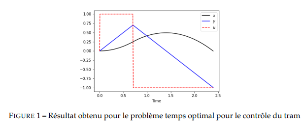
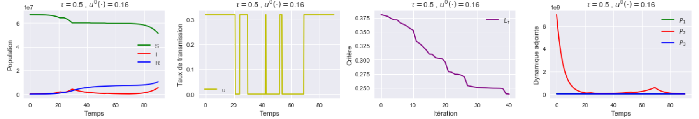
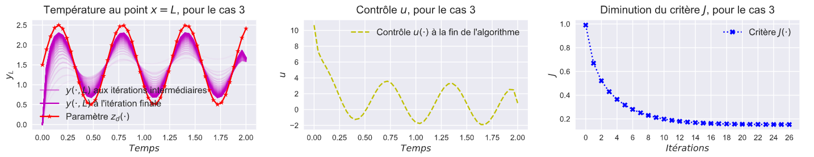

# Optimal Control
Several optimal control problems using Python, Gekko, etc.

## Screenshots

- ### Problem 1 : Problems using Gekko

- ### Problem 2 : SIR Model for COVID-19

- ### Problem 3 : Heat transfer in 1D

## Resources
- [Gekko](https://gekko.readthedocs.io/en/latest/)
